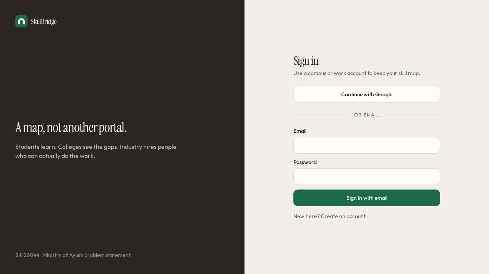
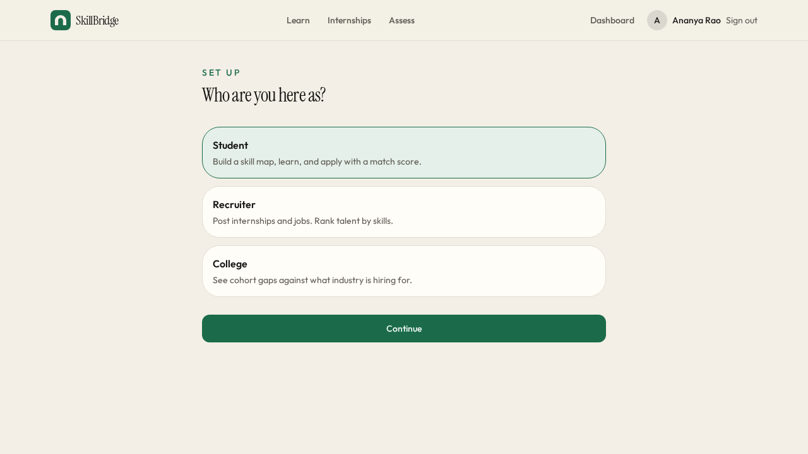
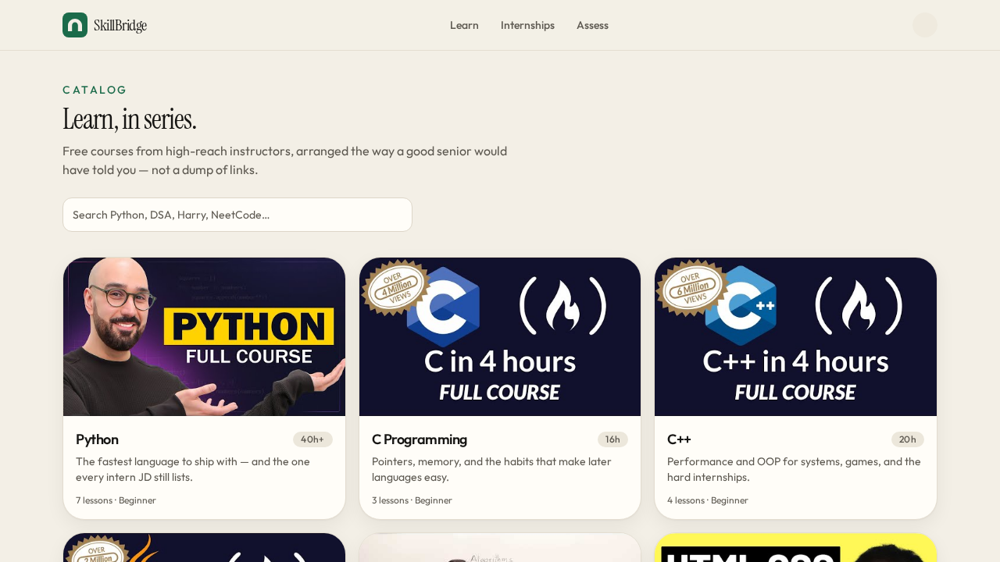
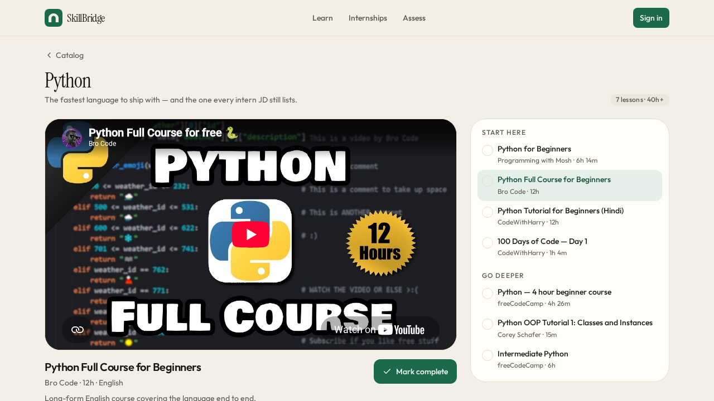
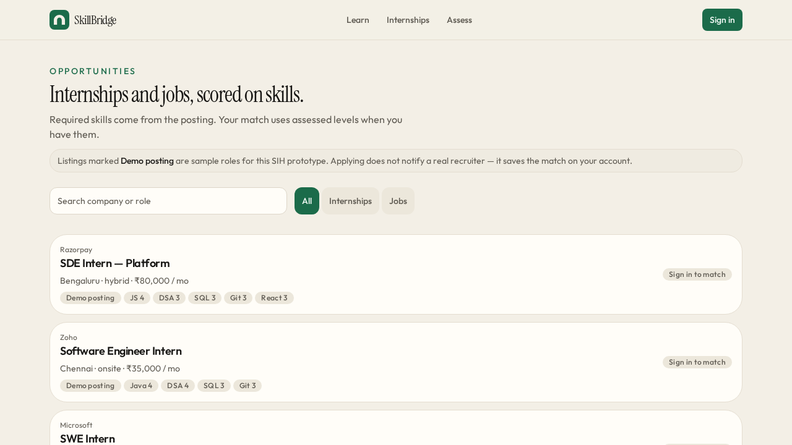
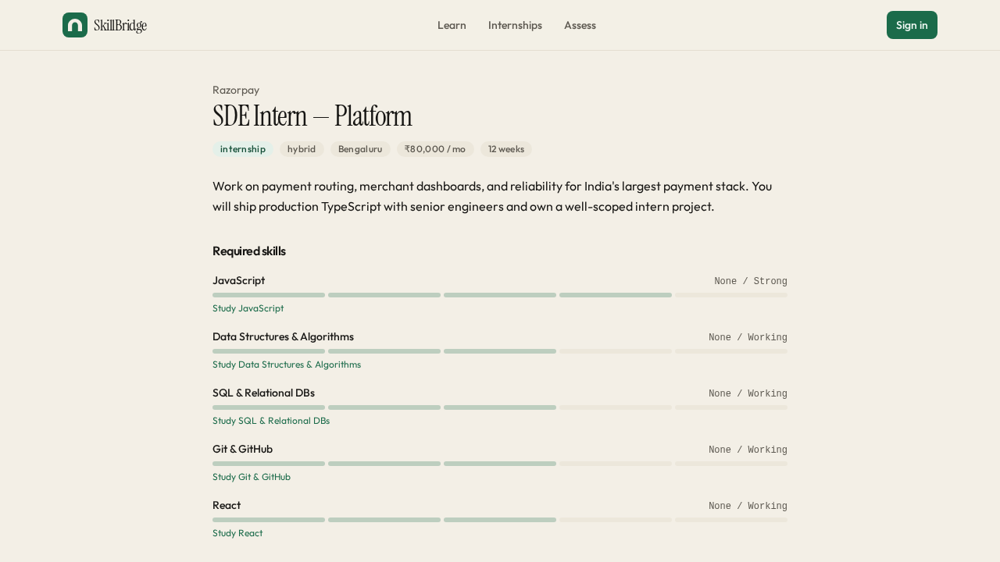

# 🌉 SkillBridge

**A skill map, not another portal.**
Students learn and prove skills → SkillBridge matches them to real internships and jobs → colleges see the gaps.

**🔗 [Open the live app](https://skill-bridge-5pb65mykp-arya-bhatta-0.vercel.app/)**

 

## 🧭 What is SkillBridge?

Built for **SIH 2026 — Problem Statement SIH26044** (skill mapping, internships, placement), SkillBridge gives each kind of user one honest view of the same data:

| Who | What they get |
|:---|:---|
| 🎓 **Students** | Assess real skill level (not self-rated guesses), follow short free-video roadmaps, and see a live match score against internships/jobs |
| 🏢 **Recruiters** | Post roles and see applicants ranked by verified, not claimed, skill |
| 🏫 **Colleges** | See where their whole cohort is weak against what industry is actually hiring for |

 

## 🚀 How to use it

### 1. Sign in

Open the [live app](https://skill-bridge-5pb65mykp-arya-bhatta-0.vercel.app/) and sign in with Google or email — no approval or setup needed, you're in immediately.

### 2. Tell it who you are

Right after signing in, pick a role. This decides what your account can see and do — you can't be a student and a recruiter on the same account.

 

### 🎓 If you're a Student

**Assess your skills** — go to **Assess**, take a short multiple-choice quiz per skill. Your assessed level replaces any self-rating everywhere else in the app, including match scores.

**Learn what you're missing** — go to **Learn** to browse the roadmap catalog: short, sequenced, free YouTube courses per skill, picked and ordered like a senior would recommend, not a dumped link list.

Open any roadmap to get an ordered lesson list with a "start here → go deeper" path. Mark lessons complete as you go.

**Find a role** — go to **Internships** to browse the job board. Filter by internship/job and search by company or title.

**Check your match and apply** — open any listing to see exactly which required skills you're strong or weak in, with one-click links to go study the gap.

**Keep track of yourself** — your **Dashboard** shows an overall match ring and skill gaps against a career goal you pick; **Portfolio** lets you attach projects/certifications/achievements to specific skills; **Applications** tracks the status of everything you've applied to.

### 🏢 If you're a Recruiter

Go to **Recruit** to post an internship or job with required skills. Applicants show up ranked by assessed match, and you can update each applicant's status (e.g. shortlisted, rejected).

### 🏫 If you're from a College

Go to **Analytics** to see your students' average skill levels by category, compared against national averages and current industry demand — so you know exactly where the cohort needs to catch up.

 

## 🎭 A note on the data

To make the app meaningful to try immediately, the job board is pre-seeded with a **Demo posting** — companies like Razorpay, Google, and Zoho — clearly labelled as such in the listing. Applying to one doesn't email a real recruiter, but it *does* save the match to your account like a real application would.

Everything else — your profile, skill levels, quiz results, lesson progress, portfolio, and applications — is real and tied to your signed-in account, and persists across sessions.

 

## ⚙️ Under the hood

Quick context, not a build manual — the point of this README is using the app, not building it.

SkillBridge is a React 19 + TanStack Start app on Postgres (Neon), with skill-matching logic and an optional AI-generated 8-week study plan (falls back to a rule-based plan if no AI key is set). Development was AI-assisted — we planned the features, made the architecture calls, and did the debugging and stress-testing ourselves rather than one-shotting it.

 

## 👥 Team — AryaBhatta-0

First-year CSE students, first hackathon.

| Member | Role |
|:---:|:---:|
| **Samrat** | Team lead — formed the team, planned the presentation, and assigned everyone a clear role |
| **Snehashish** | Found SIH26044 and pitched the idea for what to build |
| **Soumyadip** | Full-stack developer — built SkillBridge (AI-assisted) |
| **Bidhan** | Full-stack developer — strong on backend; also built his own app for this hackathon |
| **Komal** | Led the presentation delivery; also suggested SkillBridge's in-app **Learn** player, so lessons play right inside the app instead of sending students to YouTube |
| **Md Shahrukh Ali** | Joined later; handled slides and supported the presentation |

The best part wasn't just shipping something that works — it was planning it together as first-years and actually pulling it off as a team.

 
Made with ☕ by Team AryaBhatta-0

